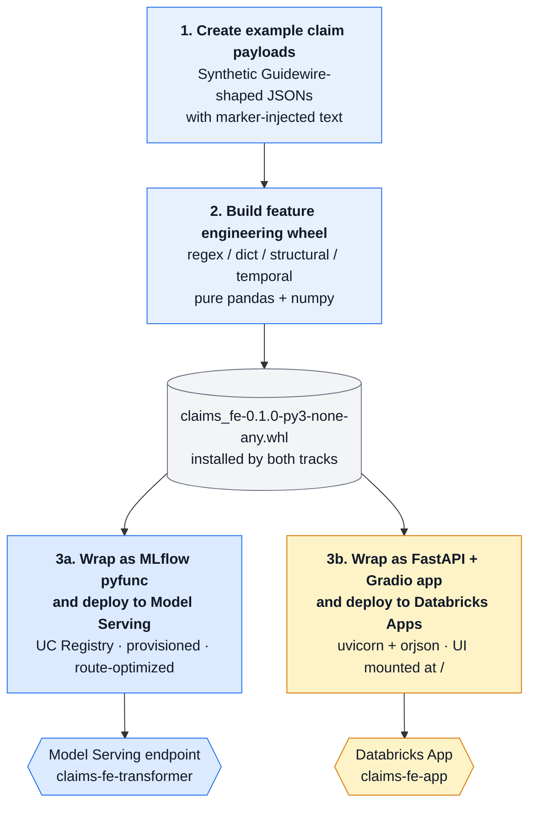

# `claims_fe` Feature-Engineering Endpoint — Prototype Workflow

Prototype that takes a raw Guidewire ClaimCenter homeowners claim JSON, runs a deterministic
feature-engineering layer (regex / dictionary / structural / temporal extractors), and serves
the resulting features through **two parallel deployment tracks** so they can be benchmarked
head-to-head:

| Approaches | Stack | Notebook | Endpoint name |
|---|---|---|---|
| **A — Model Serving pyfunc** | `mlflow.pyfunc.PythonModel` → MLflow scoring server (gunicorn) → Databricks Model Serving | `03_log_and_deploy.py` | `claims-fe-transformer` |
| **B — Databricks App** | FastAPI + uvicorn + orjson, with a Gradio UI mounted at `/` | `05_build_and_deploy_app.py` | `claims-fe-app` |

Both tracks install and call the **same wheel** (`claims_fe-0.1.0-py3-none-any.whl`), so any
latency / quality delta is purely the serving shell.

The end-state question this prototype answers: *Model Serving or Databricks Apps for an
SLA-bound, regex/dict-only feature transformer?*

---

## 1. Two Potential Approaches

For a CPU-only, no-GPU, no-LLM feature transformer, the serving shell becomes a non-trivial
fraction of total latency. Specifically:

- **Model Serving pyfunc** runs MLflow's scoring server, which converts the request body
  into a `pandas.DataFrame`, calls `predict()`, and re-serializes. Predictable, uniform, but
  has overhead from `pandas` round-tripping and MLflow's middleware.
- **Databricks App** runs a custom FastAPI+orjson stack. Lower per-request overhead, but
  loses the Model Serving niceties (auto-scaling tiers, Model Registry traffic-config,
  payload-size validation, queue back-pressure).


---

## 2. End-to-end flow



The wheel is the **shared brain** — both tracks install the same artifact, so the
only difference between the Model Serving endpoint and the Databricks App is the
serving shell wrapped around it. (Validation and head-to-head benchmarking are
covered by additional notebooks but are not shown here to keep the creation flow
crisp.)

---

## 3. The `claims_fe` wheel (the actual logic)

Built inline by notebook 02 from inline-string sources. The wheel is the single
source of truth — both serving tracks just install it.

### 3.1 Package layout

```
claims_fe/
├── __init__.py            # exports ClaimFeatureTransformer
├── lexicons.py            # all regex patterns + word lists
├── transformer.py         # ClaimFeatureTransformer (mlflow.pyfunc.PythonModel)
└── features/
    ├── __init__.py
    ├── structural.py      # length / exposure / passthrough features
    ├── temporal.py        # date-derived features
    └── text_flags.py      # regex-based flags + counts + scores
```

### 3.2 Public contract

The pyfunc input/output is the same in both tracks:

```python
# Input  (one row per claim)
pd.DataFrame({"payload_json": ["<raw JSON string>"]})

# Output (one row per claim)
pd.DataFrame({"features_json": ["<flat JSON string>"]})
```

The input `payload_json` is a stringified Guidewire ClaimCenter shape
(`{"Claims": [<claim>]}`). The output `features_json` is a flat dict containing
the keys below.

### 3.3 Output feature set

Set by `_extract_one()` in `transformer.py`. Key categories:

| Category | Source module | Keys |
|---|---|---|
| **Identity / passthrough** | `structural.py` | `claim_id`, `claim_num`, `lob_type`, `loss_cause`, `sub_type`, `state`, `jurisdiction_state`, `water_source` |
| **Structural** | `structural.py` | `desc_char_count`, `docs_char_count`, `notes_char_count`, `incidents_char_count`, `n_exposures`, `has_dwelling`, `has_contents`, `has_living_expenses`, `exposure_types` |
| **Temporal** | `temporal.py` | `loss_date`, `reported_date`, `days_loss_to_report`, `property_age_at_loss` |
| **Text flags** | `text_flags.py` | `attorney_mentioned`, `attorney_phrase_count`, `siu_red_flag_count`, `medical_severity_flag`, `subrogation_opportunity_flag`, `health_disclosure_flag`, `urgency_score`, `max_dollar_amount_mentioned`, `dollar_amount_count` |
| **Metadata** | `transformer.py` | `feature_version`, `extraction_errors` |

Notebooks 02 and 04 share this list as `REQUIRED_KEYS` and assert on it — schema
is enforced by both the wheel-sanity-test (after build) and the endpoint-parity
test (after deploy).

### 3.4 Module-by-module deep dive

#### `lexicons.py` — the pattern dictionary

The dumbest, most important file in the wheel. Seven categories of patterns, all
defined as raw strings with `\b` word boundaries, then compiled to `re.Pattern`
objects at module import time:

```python
ATTORNEY_PATTERNS = [
    r"\bretained counsel\b",
    r"\bletter of representation\b",
    r"\bLOR\b",
    r"\bcease\s+(?:and\s+desist|communication|contact)\b",
    r"\bdemand letter\b",
    ...  # 12 total
]

# Same shape for: SIU_PATTERNS (12), MEDICAL_PATTERNS (12),
# SUBROGATION_PATTERNS (8), HEALTH_PATTERNS (8)

URGENCY_WORDS = ["URGENT", "ASAP", "IMMEDIATELY", "EXPEDITE", "TIME-SENSITIVE"]
DOLLAR_PATTERN = r"\$\s?(\d{1,3}(?:,\d{3})*(?:\.\d{2})?)"

def _compile_all(patterns):
    return [re.compile(p, re.IGNORECASE) for p in patterns]

COMPILED = {
    "attorney":    _compile_all(ATTORNEY_PATTERNS),
    "siu":         _compile_all(SIU_PATTERNS),
    "medical":     _compile_all(MEDICAL_PATTERNS),
    "subrogation": _compile_all(SUBROGATION_PATTERNS),
    "health":      _compile_all(HEALTH_PATTERNS),
    "dollar":      re.compile(DOLLAR_PATTERN),
}
```

Three design choices baked in:

1. **Word boundaries (`\b`) on everything.** Prevents "Lor" inside "Loretto, CA"
   from tripping the `LOR` attorney flag.
2. **`re.IGNORECASE` for the dictionaries** but `URGENCY_WORDS` is matched
   case-sensitively in `text_flags._urgency_score` (using plain `text.count("URGENT")`).
   Caps in adjuster notes are themselves a signal — "URGENT" and "urgent" should
   score differently.
3. **Compile-once-at-import.** `COMPILED` is built when the module first loads.
   Every `predict()` call afterwards is dict lookup + regex apply, no per-request
   compile cost.

#### `features/structural.py` — pure dict munging

No regex, no dates, just length and presence:

```python
def structural_features(claim: dict) -> dict:
    docs       = claim.get("ConcatenatedDocs") or ""
    notes      = claim.get("ConcatenatedNotes") or ""
    incidents  = claim.get("ConcatenatedIncidents") or ""
    desc       = claim.get("CLM_DESC_TXT") or ""

    exposures = claim.get("Exposures") or []
    exposure_types = [e.get("EXPSR_TYP_CD") for e in exposures if e.get("EXPSR_TYP_CD")]

    return {
        "desc_char_count":      len(desc),
        "docs_char_count":      len(docs),
        "notes_char_count":     len(notes),
        "incidents_char_count": len(incidents),
        "n_exposures":          len(exposures),
        "has_dwelling":         "Dwelling" in exposure_types,
        "has_contents":         "Content" in exposure_types,
        "has_living_expenses":  "LivingExpenses" in exposure_types,
        "exposure_types":       exposure_types,
        "lob_type":             claim.get("CLM_LOB_TYP_CD"),
        "loss_cause":           claim.get("LOSS_CSE_TYP_CD"),
        # ... + sub_type, state, jurisdiction_state, water_source, claim_id, claim_num
    }
```

Two purposes:

- **Char counts** become a downstream feature: longer notes can indicate complex
  claims; very short notes plus a high reserve is suspicious.
- **Exposure presence flags** fire the boolean `has_X` features. Looks up by
  typecode (not index) so it's robust to ordering / count of exposures.

The `or ""` and `or []` patterns guard against null fields without raising — the
function should never blow up on a partial payload.

#### `features/temporal.py` — Guidewire date handling

Two derived features and one quirk-aware date parser:

```python
def _parse(dttm: str):
    if not dttm:
        return None
    # Handle the trailing ".0000000" style seen in Guidewire exports
    if "." in dttm:
        head, _, _tail = dttm.partition(".")
        dttm = head
    try:
        return datetime.strptime(dttm, "%Y-%m-%dT%H:%M:%S")
    except ValueError:
        return None
```

The `.0000000` truncation is the workaround for ClaimCenter's 7-digit fractional
seconds (`2024-10-07T22:46:48.5830000`). Standard `%f` only takes 6 digits;
rather than fight the format, drop everything after the dot.

The two emitted features:

```python
days_loss_to_report = (reported - loss).days        # late-reporting signal
property_age_at_loss = loss.year - construction_year # wear-related signal
```

Both are commonly correlated with fraud risk and severity in real homeowners
models. Returns `None` when either input is missing — no silent zero, no exception.

#### `features/text_flags.py` — the value-add

Three helpers plus one entry point.

```python
def _count_matches(text, compiled_list) -> int:
    """Number of patterns that hit at least once."""
    return sum(1 for r in compiled_list if r.search(text))

def _count_all_matches(text, compiled_list) -> int:
    """Total match count across all patterns."""
    return sum(len(r.findall(text)) for r in compiled_list)
```

The distinction matters. `_count_matches` over the attorney patterns gives
"*how many distinct attorney signals are present?*" (a 0–12 integer that maps
neatly to "is this represented? is it well-represented?"). `_count_all_matches`
gives "*how heavy is the attorney mention?*" — one note can mention "demand
letter" three times.

The **urgency score** is the only place feature engineering gets opinionated:

```python
def _urgency_score(text: str) -> float:
    length = max(len(text), 1)
    urgent_hits      = sum(text.count(w) for w in URGENCY_WORDS)
    exclamation_count = text.count("!")
    alpha = [c for c in text if c.isalpha()]
    caps_ratio = (sum(1 for c in alpha if c.isupper()) / len(alpha)) if alpha else 0.0

    score = min(
        1.0,
        urgent_hits      * 0.15
        + (exclamation_count / (length / 1000)) * 0.01
        + caps_ratio * 0.3,
    )
    return round(float(score), 4)
```

A 0–1 score combining urgent-word hits, exclamation density (per 1000 chars to
normalize for length), and caps ratio. Weights (`0.15`, `0.01`, `0.3`) are tunable
knobs chosen so one URGENT word alone gets to ~0.15, three exclamations per 1000
chars adds a tiny bump, and an all-caps note hits the ceiling. `min(..., 1.0)`
caps pathological notes.

**Dollar extraction:**

```python
def _dollar_amounts(text: str):
    matches = COMPILED["dollar"].findall(text)   # ["12,450.00", "3,875.25", ...]
    amounts = []
    for m in matches:
        try:
            amounts.append(float(m.replace(",", "")))
        except ValueError:
            continue
    return amounts
```

Handles `$12,450.00`, `$ 18700`, and everything in between. Strips commas, casts
to float, skips anything that fails to parse.

The entry point glues them together over a single combined corpus:

```python
def text_flag_features(claim: dict) -> dict:
    notes     = claim.get("ConcatenatedNotes") or ""
    docs      = claim.get("ConcatenatedDocs") or ""
    incidents = claim.get("ConcatenatedIncidents") or ""
    combined  = " ".join(filter(None, [notes, incidents, docs]))

    dollar_amounts = _dollar_amounts(combined)

    return {
        "attorney_mentioned":            _count_matches(combined, COMPILED["attorney"]) > 0,
        "attorney_phrase_count":         _count_all_matches(combined, COMPILED["attorney"]),
        "siu_red_flag_count":            _count_matches(combined, COMPILED["siu"]),
        "medical_severity_flag":         _count_matches(combined, COMPILED["medical"]) > 0,
        "subrogation_opportunity_flag":  _count_matches(combined, COMPILED["subrogation"]) > 0,
        "health_disclosure_flag":        _count_matches(combined, COMPILED["health"]) > 0,
        "urgency_score":                 _urgency_score(combined),
        "max_dollar_amount_mentioned":   max(dollar_amounts) if dollar_amounts else None,
        "dollar_amount_count":           len(dollar_amounts),
    }
```


#### `transformer.py` — the MLflow pyfunc wrapper

What makes the wheel deployable as a Model Serving endpoint:

```python
class ClaimFeatureTransformer(mlflow.pyfunc.PythonModel):
    def load_context(self, context):
        pass    # No artifacts to load — lexicons/regex compile at import

    def predict(self, context, model_input, params=None):
        if isinstance(model_input, pd.DataFrame):
            series = model_input.iloc[:, 0]
        else:
            series = pd.Series(model_input)
        outputs = [json.dumps(_extract_one(s)) for s in series.astype(str).tolist()]
        return pd.DataFrame({"features_json": outputs})
```

The per-row workhorse:

```python
def _extract_one(payload_json: str) -> dict:
    errors = []
    try:
        payload = json.loads(payload_json)
    except Exception as exc:
        return {"claim_id": None, "claim_num": None,
                "feature_version": FEATURE_VERSION,
                "extraction_errors": [f"json_parse_error: {exc}"]}

    claims = payload.get("Claims") or []
    if not claims:
        return {"claim_id": None, "claim_num": None,
                "feature_version": FEATURE_VERSION,
                "extraction_errors": ["no_claims_in_payload"]}

    claim = claims[0]
    out = {}
    for fn, name in [(structural_features, "structural"),
                     (temporal_features, "temporal"),
                     (text_flag_features, "text_flags")]:
        try:
            out.update(fn(claim))
        except Exception as exc:
            errors.append(f"{name}_error: {exc}")

    out["feature_version"] = FEATURE_VERSION
    out["extraction_errors"] = errors
    return out
```

Five things baked into this orchestration:

1. **JSON in, JSON out.** Input is a stringified Guidewire claim payload; output
   is a stringified flat features dict. Keeps the MLflow signature trivial
   (`{payload_json: string} → {features_json: string}`) and lets downstream
   callers parse selectively or pass it on without touching it.
2. **Per-extractor try/except.** If `text_flag_features` raises on a degenerate
   payload, you still get `structural` + `temporal` features. The error is
   recorded in `extraction_errors[]`, not swallowed and not raised. Crucial for
   SLA: a partial answer is better than a 500.
3. **First-claim-only assumption.** `claim = claims[0]` — multi-claim payloads
   silently use the first. Simplification for v1; multi-claim shape would need
   different aggregation logic that's out of scope.
4. **Two-phase failure handling.** Top-level (JSON parse, no claims) returns a
   minimal stub with all error info up front. Per-extractor failures still
   produce the partial result and flag it. Two different error grades.
5. **`feature_version` baked into every output.** Lets downstream consumers and
   Inference Tables key on the version of the wheel that produced the features.
   Bumping the wheel version (`02_build_wheel.py` constant) propagates everywhere.

### 3.5 Why this shape vs alternatives

**vs. a Spark UDF.** UDFs are great for batch but require Spark on the caller
side. The pyfunc wheel works as both online (Model Serving / App) and offline
(notebook batch with `transformer.predict(spark_df.toPandas())`). Same code, two
access patterns.

**vs. shipping the source files in `mlflow.pyfunc.log_model(code_paths=...)`.**
Shipping the wheel in `pip_requirements` means you build the package once,
version it once, and any consumer (the Model Serving endpoint, the App, a future
batch job, your laptop) installs the same artifact with the same hash.
`code_paths` would re-bundle on every `log_model` call.

**vs. one giant `extract.py` file.** Three modules + lexicons keeps each piece
short enough to hold in your head. When v2 adds embedding-based features, it
slots into a fourth `features/embeddings.py` — `transformer.py`'s for-loop just
gets a new entry, nothing else changes.

**vs. a class hierarchy.** Pure functions taking `claim: dict` and returning
`dict`. No state to manage, no inheritance to reason about, trivially testable
in isolation.

---

## 4. Notebook-by-notebook detail

### 4.1 `01_generate_synthetic_payloads.py` — Test fixture generator

**What it does:**
- Generates `N_PAYLOADS=50` synthetic claims across 5 LOB / loss-cause combinations
  (water, fire, wind, theft, liability — all Homeowners HOE).
- Each claim has `Exposures` shaped to its loss type (theft → contents+dwelling;
  liability → BI+med-pay; everything else → dwelling+contents+living-expenses).
- Builds `ConcatenatedDocs`, `ConcatenatedNotes`, `ConcatenatedIncidents` from
  per-LOB phrase banks. Text size knobs (`NOTE_REPEATS`, `DOC_REPEATS`) let you
  dial from ~2 KB to ~400 KB per payload.

**Marker injection** — the testing trick:
- Each payload gets 0–3 randomly-chosen markers from `{attorney, siu, medical,
  subrogation, urgency, dollar, health}`.
- Each marker is a phrase known to trigger its corresponding feature flag in the
  wheel (e.g. "retained counsel" trips `attorney_mentioned=True`).
- The injected markers are recorded in the `markers_injected` column of the Delta
  table, so notebook 04 can assert *for each marker, the corresponding flag fired*.
  This is the parity check that gives confidence the deployed endpoint is correct.

**Outputs:**
- `/Volumes/fins_genai/classic_ml/fe_test_payloads/SYN-{000–049}.json` (raw JSON files,
  each shaped like `SamplePayload.json` at the repo root)
- `fins_genai.classic_ml.fe_test_payloads` Delta table with columns:
  `payload_id`, `lob_type`, `loss_cause`, `markers_injected`, `payload_json`

### 4.2 `02_build_wheel.py` — Inline-source wheel builder

**What it does:**
- Holds the entire `claims_fe` source tree as Python triple-quoted strings in the
  notebook (`SOURCES` dict mapping rel-path → contents).
- Materializes them to `/tmp/claims_fe_build/`, runs `python -m build --wheel`, then
  copies the resulting `.whl` to a UC Volume.
- After the build, it `%pip install`s the wheel in the notebook kernel and runs
  one synthetic payload through `ClaimFeatureTransformer` to assert the
  `REQUIRED_KEYS` contract.

**Why inline strings?**
The whole feature-eng package fits in ~12 KB of Python. Keeping it in the notebook
means the prototype is self-contained — you don't need a separate repo,
`pip install -e`, or DBR git fetch. Promoting to production is "lift these
strings into a real source tree."

**Outputs:**
- `/Volumes/fins_genai/classic_ml/claims_fe_wheels/claims_fe-0.1.0-py3-none-any.whl`

### 4.3 `03_log_and_deploy.py` — Model Serving track

**What it does:**
- Writes a tiny `fe_shim.py` to the wheel volume containing only:
  ```python
  from claims_fe.transformer import ClaimFeatureTransformer
  import mlflow
  mlflow.models.set_model(ClaimFeatureTransformer())
  ```
- Calls `mlflow.pyfunc.log_model(python_model=SHIM_PATH, ...)` — note the
  `python_model` arg points at a *file*, not a class. This is the modern
  "Models from Code" pattern.
- Pins `claims_fe @ /Volumes/.../claims_fe-0.1.0-py3-none-any.whl` in
  `pip_requirements`. At serving build-time, Model Serving's container builder
  resolves this by reading the wheel from the UC Volume.
- Registers to UC (`fins_genai.classic_ml.claims_fe_transformer`).
- Calls `client.update_endpoint()` (or falls back to `create_endpoint()`) for a
  provisioned `Small` endpoint with `scale_to_zero_enabled=False`.


**Outputs:**
- Registered model `fins_genai.classic_ml.claims_fe_transformer` (new version each run)
- Serving endpoint `claims-fe-transformer` (route-optimized, READY in ~10–15 min)

### 4.4 `04_test_fe_endpoint.py` — Track-A validation

Three sequential checks against the deployed pyfunc endpoint:

1. **Local parity** — `mlflow.pyfunc.load_model()` and `predict()` against all 50
   payloads in one batch. Asserts every required key is present and
   `extraction_errors == []`.
2. **Marker parity** — for each payload's `markers_injected`, asserts the
   corresponding feature lit up (e.g. `markers_injected=["attorney"]` →
   `attorney_mentioned == True`). Catches regressions where regex changes silently
   demote a flag.
3. **Endpoint parity** — sends the same 50 payloads to the deployed endpoint via
   `WorkspaceClient.serving_endpoints.query()`. Compares output byte-for-byte
   against the local `predict()` results. If wheels diverge between local kernel
   and the serving container, this is where it shows up.

Then a baseline latency probe (concurrency 1 / 10 / 50) using
`ThreadPoolExecutor` — same shape as notebook 06's probe but pyfunc-only.

### 4.5 `05_build_and_deploy_app.py` — Databricks Apps track

**What it does:**
1. Reads `N_SAMPLES_FOR_UI=10` rows from the Delta table and bakes them into
   `app/samples.json` — the Gradio UI loads these at startup. No warehouse
   lookup at runtime.
2. Uploads every file in `app/` to `/Workspace/Users/<me>/claims_fe_app/` via
   `WorkspaceClient.workspace.upload(format=ImportFormat.RAW, overwrite=True)`.
3. Creates the Databricks App `claims-fe-app` if missing
   (`apps.create_and_wait()`), then triggers a deploy from the workspace
   source path (`apps.deploy_and_wait()`).
4. Polls until `compute_status.state` is ACTIVE; prints the app URL plus the
   three accessible paths.

**App structure (`./app/`):**

| File | Role |
|---|---|
| `app.yaml` | Databricks Apps manifest — `command: ["python", "app.py"]`, declares the wheels-volume resource grant |
| `requirements.txt` | Pins the wheel via `claims_fe @ file:///Volumes/...whl` (resolved during the platform's pip-install step at deploy) |
| `app.py` | FastAPI app with `/transform`, `/health`, and Gradio mounted at `/`. Reads port from `DATABRICKS_APP_PORT` / `GRADIO_SERVER_PORT` / `PORT` (in that order) — hardcoding 8080 was the original cause of "App Not Available" with no access logs |
| `models.py` | Pydantic v2 request / response (`TransformRequest`, `TransformResponse`, `HealthResponse`) |
| `transformer_loader.py` | Module-level singleton holder for `ClaimFeatureTransformer` |
| `ui.py` | Gradio UI (samples dropdown, payload textarea, transform button, features table). Calls the transformer **in-process** — not via HTTP loopback. The earlier loopback design broke when the platform injected a non-8080 port |
| `samples.json` | Generated each deploy by notebook 05 (10 payloads from the Delta table) |

**Two non-obvious behaviors worth flagging:**

1. **Lifespan warm-up** in `app.py`:
   ```python
   @asynccontextmanager
   async def lifespan(_):
       transformer_loader.get()   # warms the singleton + regex compile
       yield
   ```
   Without this, the first request after deploy pays the regex-compile + import
   cost (~50 ms). After it, `transformer_loader.get()` is a dict lookup.

2. **In-process Gradio call instead of HTTP loopback** in `ui.py`. Original
   design had the UI do `requests.post("http://localhost:8080/transform")`.
   That's brittle on Apps because the platform injects the listen port via
   env var — the UI can be on one port and the FastAPI server on another.
   Calling the transformer directly sidesteps the issue and removes one HTTP
   hop from the UI path.

### 4.6 `06_compare_endpoints.py` — Head-to-head

**Note**: Databricks app current do not support auto-scaling

**What it does:**
1. Resolves both endpoints. Asserts pyfunc state is `READY` and app state contains
   `ACTIVE`.
2. Builds 3 size tiers from the base 50 payloads:
   - `small` (~2 KB) — base text
   - `medium` (~40 KB) — text fields × 20
   - `large` (~200 KB) — text fields × 100
3. Defines two callers — `call_pyfunc()` uses
   `WorkspaceClient.serving_endpoints.query()`, `call_app()` does
   `requests.Session()` POST with auth headers populated by
   `w.config.authenticate(req)` (Apps require OAuth; PATs don't authenticate).
4. **Equality check** — first 10 payloads, asserts pyfunc and app return identical
   features. If they diverge, the wheels in the two tracks have drifted; stop and
   reconcile before trusting any latency number.
5. **Latency probe** — `ThreadPoolExecutor` for concurrency × `n_requests` (30 at
   c=1, 100 otherwise). Reports p50/p95/p99/max/errors per `(system, size, conc)`
   cell.
6. Pivots into a side-by-side table and a delta table.

**Reading the output:**

- *c=1 delta* = pure serving-shell overhead (MLflow middleware + pandas vs
  FastAPI + orjson).
- *c=10/50 delta* additionally reflects worker / GIL behavior under load.
  Apps wins → architectural advantage. Pyfunc holds → workload_size compensates.
- *Larger size tiers* magnify body-decode cost — pandas-DataFrame conversion in
  MLflow is where pyfunc tends to lose ground.
- *Error rate > 1%* in any cell → that row's comparison is untrustworthy.
  Re-run with lower concurrency or bigger workload size.

---

## 5. Running the workflow end-to-end

```
01 → 02 → 03 → 04   ✅  Track A working
        ↘
         05 → 06   ✅  Track B comparable to A
```

Order matters because each notebook materializes inputs the next consumes. Cross-cutting
constants (catalog/schema, table name, wheel version, endpoint name) are declared at the
top of each notebook — keep them in lockstep when bumping versions.

Typical wall-clock the first time:
- 01: ~30 s
- 02: ~2 min (pip install + build + sanity test)
- 03: ~12 min (logging is fast; **endpoint READY takes ~10–15 min** — pandas+numpy container build)
- 04: ~3 min (assuming endpoint is READY)
- 05: ~5 min (Apps creation + deploy)
- 06: ~10 min (warm both, then 3×3×2 probe matrix at 100 reqs/cell = ~1800 calls)

Subsequent runs of 03 (model logging only, endpoint already exists) drop to ~3 min because
only the config-update path runs. Subsequent runs of 05 are ~2 min for source upload + redeploy.

---