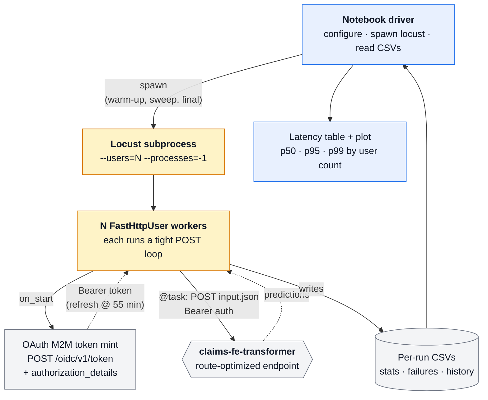

# Load Testing — `claims-fe-transformer` Endpoint

Locust-driven load test for the route-optimized Model Serving endpoint
deployed by `notebooks/fe_endpoint_prototype/03_log_and_deploy.py`.

The notebook spawns a Locust subprocess with `N` concurrent users that hammer
the endpoint, captures p50 / p95 / p99 latencies and failure rates per run,
sweeps a range of user counts to find the per-user latency curve, and then
guides you to the endpoint concurrency you need to provision in order to
serve a target requests-per-second at acceptable tail latency.

Originally a Databricks workspace notebook; a parallel locally-runnable copy
is included.

---

## Flow



The driver runs three Locust invocations in sequence — each writes its own
set of CSVs which the notebook then aggregates:

| Stage | What | Why |
|---|---|---|
| **1. Warm-up** | 30 s × 4 users | Primes JIT, fills connection pool, eliminates cold-start spike from measurement |
| **2. Sweep** | 5 min × {2, 3, 4, 5} users | Discovers the per-user latency curve before scaling decisions |
| **3. Final** | 60 min at the target scale | Sustained run that confirms the chosen `USER_COUNT × concurrency` holds at SLA |

Between stages 2 and 3 you read the latency table, pick the
highest-acceptable user count and a target RPS, and the notebook computes
the endpoint concurrency you need to provision (then nudges you to resize
the endpoint before kicking off the 60-min run).

---

## Files

| File | Role |
|---|---|
| `fast_load_test.py` | Locust `FastHttpUser` definition. Reads `input.json`, mints an OAuth M2M token via `/oidc/v1/token` with `authorization_details` scoped to the route-optimized endpoint, then POSTs to `serving-endpoints/{name}/invocations` in a tight loop with Bearer auth. Tracks token expiry and refreshes at 55 min. |
| `input.json` | Request body — MLflow `dataframe_split` envelope with one tornado-claim `payload_json` (~15 KB). |
| `Load Test Notebook.ipynb` | **Original** workspace notebook. Uses `dbutils.secrets.get()` and `dbutils.library.restartPython()` — runs only inside Databricks. |
| `Load Test Notebook (local).ipynb` | **Local-runnable copy.** Loads `.env` from the project root, anchors cwd via `__vsc_ipynb_file__` (or `rglob` fallback), and replaces `dbutils` calls. Otherwise identical orchestration logic. |
| `_patch_local_notebook.py` | Idempotent patcher — re-run after `cp`-ing a fresh original to regenerate the local copy. |

---

## How each Locust user behaves

```python
class LoadTestUser(FastHttpUser):
    def on_start(self):
        self.model_input = json.load(open("input.json"))
        # … reads env vars set by the notebook …
        self.oauth, self.expiration = self.get_oauth_token()

    def get_oauth_token(self, lifetime=timedelta(minutes=55)):
        # POST /oidc/v1/token, client_credentials grant,
        # authorization_details scoped to /serving-endpoints/{ENDPOINT_ID}
        # action: query_inference_endpoint
        ...

    @task
    def query_single_model(self):
        if datetime.now() > self.expiration:
            self.oauth, self.expiration = self.get_oauth_token()
        self.client.post(
            f"serving-endpoints/{self.endpoint_name}/invocations",
            headers={"Authorization": f"Bearer {self.oauth}"},
            json=self.model_input,
        )
```

Each `FastHttpUser` instance maintains its own connection pool, its own
token, and its own request loop. With `--processes -1`, Locust spawns one
process per CPU core; each process gets its share of users. Token mints
happen **per process at startup**, not per user — so `--users=8 --processes=4`
costs 4 mints, not 8.

---

## Running

### In Databricks workspace

1. Open `Load Test Notebook.ipynb` on a **dedicated** cluster (not Serverless) with
   `15.4 LTS ML` runtime and many cores. Locust is CPU-bound on the client.
2. Create a [service principal](https://docs.databricks.com/aws/en/machine-learning/model-serving/query-route-optimization#fetch-an-oauth-token-and-query-the-endpoint)
   and grant it **CAN_QUERY** on the endpoint.
3. Store its `client_id` and `client_secret` in a Databricks secret scope; reference
   them in cell 4 (`dbutils.secrets.get(scope=..., key=...)`).
4. Run all cells top-to-bottom.

### Locally (laptop, VSCode, or Jupyter Lab)

Prereqs (once):

```bash
# from the project root
uv add 'locust==2.32.6' 'gevent==24.11.1' matplotlib pandas ipykernel
```

Then either of:

```bash
# Option A — VSCode
code "notebooks/fe_endpoint_prototype/load_testing/Load Test Notebook (local).ipynb"
# In the editor: top-right → Select Kernel → .venv (Python 3.12)

# Option B — Jupyter Lab
cd notebooks/fe_endpoint_prototype/load_testing
uv run jupyter lab "Load Test Notebook (local).ipynb"
```

Cell 4 walks up from cwd to find the project `.env`, loads `CLIENT_ID` /
`CLIENT_SECRET`, and chdirs to this folder so all relative paths work
regardless of where the kernel started.

---

## Caveats

- **Laptop numbers are inflated.** Full-tunnel VPN adds ~30 ms RTT and ~70 ms
  to the TLS handshake compared to in-workspace consumers. Treat laptop
  numbers as a *relative ranking* across user counts, not as absolute SLA
  numbers.
- **Locust is CPU-bound on the client.** `--processes -1` uses every core.
  The notebook detects `"CPU"` in Locust's stdout and aborts via `Exception`.
  Lower `client_connections_test_values` if you hit it.
- **Service principal must have CAN_QUERY** on the endpoint, not just on the
  workspace. Easy to forget — set it once via Serving → endpoint → Permissions.
- **`input.json` envelope is `dataframe_split`** without a wrapper key. MLflow's
  scoring server accepts this, but if you ever see a 400, wrap it explicitly:
  `{"dataframe_split": {"columns": [...], "data": [...]}}`.
- **Output CSVs land in cwd.** When running locally, that means this folder
  (cell 4 anchors cwd here). The next run *overwrites* same-named CSVs — stash
  them somewhere else if you want to compare.

---

## Related

- `../README.md` — full prototype workflow (data generation → wheel → endpoint)
- `../comparison.html` — Model Serving vs Databricks App side-by-side
- `../../../scripts/test_endpoint_curl.sh` — lower-overhead curl probe for quick
  sanity checks before reaching for Locust
